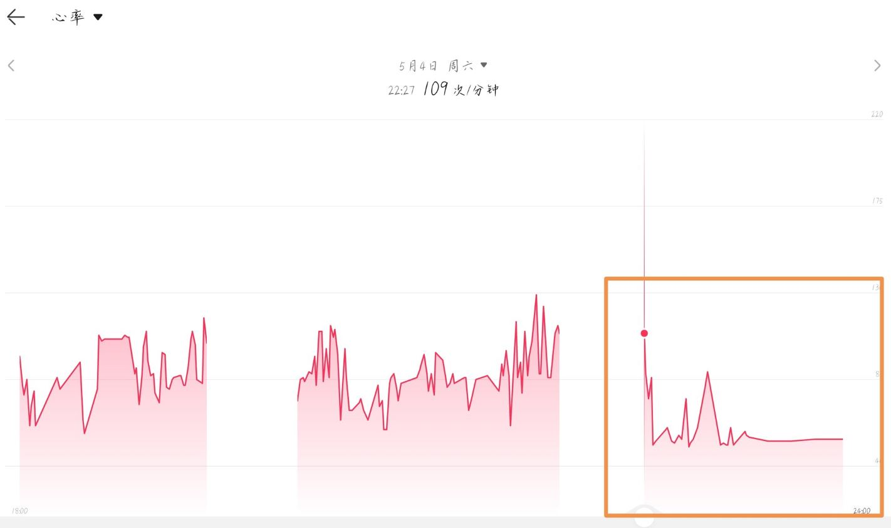

报告者：曹玉(化名)
处理报告者：超级后后后藤
身高体重：？cm, 65kg
报告时：2024.05.05.09:52
记入时：2024.05.05.11:00

有关药物：[茶氨酸](/Drugs/TAN)、[酪氨酸](/Drugs/SPM)

### 原报告

降低心率，肌肉松弛，od茶氨酸还需谨慎！

药物：茶氨酸8g，酪氨酸4g

于9点30分服用上述药物加水250毫升

30分钟后，开始有触觉增益，表现为原本已经不疼的伤口出现痛觉，肌肉有很轻微酸痛感

50分钟后，开始有肌松效果，感受为身体沉重（这一点非常明显！）同时，伴随心率降低，心跳强度减弱（心率约55）

1.5小时肌松进一步加强，心率进一步降低（这个时候手表心率过低报警）同时自主呼吸强度大大减弱

这一点需要格外警惕，格外警惕，格外警惕！因为高剂量下的肌松可能会导致心率过低，供氧不足以及呼吸暂停！

两小时后进入睡眠状态，并没有梦境强化唯一与平时不同，是梦境更有逻辑感，更符合现实，至少醒来复盘时，梦境中没有明显的逻辑漏洞和事实错误。睡眠数据和心率数据见下图

11小时后肌松效果仍然存在这时我出门运动明显能够感到运动能力减弱对协调能力可能没有较大影响，但是由于肌肉松弛，在高强度运动下，还是出现了悲剧（摔得好痛呜呜呜呜呜呜呜啊啊啊）

回顾一下，整体上，茶氨酸认知强化和镇静的效果是明显的整个过程虽然出现意外但感觉上还算良好主观认知上有一种轻松的愉悦感（并不强）也许他在抗焦虑方面可以媲美苯二氮卓类（另外虽然我使用它的主要目的是助眠很多人反馈在低剂量下就有嗜睡的情况但实际上，他并没有让入睡变快，但对睡眠质量可能有一些帮助）

所以茶氨酸并没有我们想象中的那么安全，od还是先从小剂量一点一点开始试吧

橙色方框圈起来的是服药以后的

【图片表示，在服药前心率平均在80，服药后几乎是骤降，来到了57附近】

上面这个图片全部都是服药后的

【图片表示，这种心率的骤降非常稳定，稳定于57】

【图片表示，睡眠时间仅有7h46h】

这是睡眠

我觉得你在茶氨酸的Wiki里说法很不准确

大剂量的茶氨酸真的不安全

这个心率真的把我自己吓到了

### 分析
很奇怪的是，笔者后藤在od茶氨酸（至少20g）后并不会出现这种奇怪的现象。看来茶氨酸需要验证毒性咯！